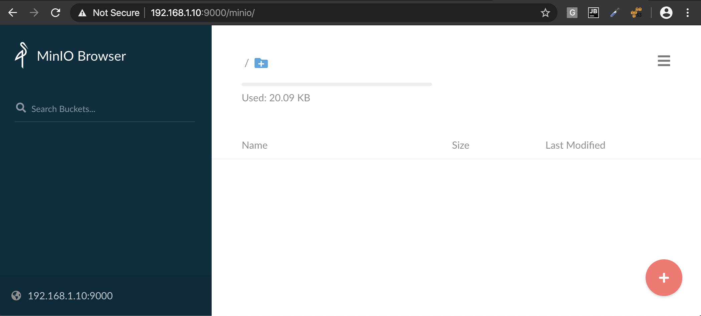

# Minio on a Raspberry Pi 4 with Raspbian (Debian Buster 10.0)

The Raspberry Pi 4 Model B single board computer from the [Raspberry Pi Foundation](https://www.raspberrypi.org) has a 1.5 GHz quad-core ARMv8 CPU, 1 to 4 GByte main memory and a Gigabit Ethernet interface. 

This installation tutorial explains the installation of a Raspberry Pi 4 device from scratch and the configuration of [s3cmd](http://s3tools.org) on your computer. 

_This implies that you have already an installation of `s3cmd` on the system you want to use for the interaction with the Minio storage service._

## Configure NTP to have the correct Time on the Raspberry Pi Computer

_This is not required for running Minio, but it is always useful to have the correct time on a computer_

    $ sudo apt-get update && sudo apt-get install -y ntp ntpdate

Now the time sould be synchronized with several NTP servers.

    $ ntpq -p
         remote           refid      st t when poll reach   delay   offset  jitter
    ==============================================================================
     0.debian.pool.n .POOL.          16 p    -   64    0    0.000    0.000   0.001
     1.debian.pool.n .POOL.          16 p    -   64    0    0.000    0.000   0.001
     2.debian.pool.n .POOL.          16 p    -   64    0    0.000    0.000   0.001
     3.debian.pool.n .POOL.          16 p    -   64    0    0.000    0.000   0.001
    +draco.spiderspa 213.251.128.249  2 u 1002 1024  377   39.409   -0.676   0.418
    *68-69-221-61.nb .ROSS.           1 u   68 1024  377   42.473   -0.495   0.713
    -162.159.200.1   10.29.8.91       3 u  842 1024  377    7.850    0.343   3.070
    +portal.switch.c 213.251.128.249  2 u  634 1024  377   40.174   -0.499   0.297
    -162.159.200.123 10.29.8.91       3 u  611 1024  377    7.699    0.281   6.656
    +ns5.pra.rip     137.183.22.172   3 u  610 1024  377   40.501   -0.308   0.311

Check the time and date:

    $ date -R
    Sat, 05 Oct 2019 15:18:36 +0200

## Installation

| Type                        | Comments |
|-----------------------------|----------|
| [Manual](install/manual.md) |          |
| [Docker](install/docker.md) |          |

Minio provides a handy web user interface.

    
## Configure the `~/.s3cfg` file to make `s3cmd` working with Minio

Install `s3cmd` using `Homebrew` package manager

    $ brew install s3cmd

All required steps are described here: [https://docs.minio.io/docs/s3cmd-with-minio](https://docs.minio.io/docs/s3cmd-with-minio)

Just these lines need to be modified:

    $ vi ~/.s3cfg 
    access_key = KYNUR02NE46743GT0JDT
    secret_key = rN3cV4o+NclcDSf+IjBCgFoaAonF86TDOem81zMg
    host_base = 192.168.1.10:9000
    host_bucket = 192.168.1.10:9000
    bucket_location = us-east-1
    use_https = False
    signature_v2 = False

Now s3cmd should work properly with the Minio service.

    $ s3cmd mb s3://testbucket
    Bucket 's3://testbucket/' created
    $ s3cmd ls
    2019-12-29 18:12  s3://testbucket

**Important !!!** When using `s3cmd` together with Minio, the buckets names must not contain capital letters. Otherwise you will just get this error message:

    $ s3cmd mb s3://TESTBUCKET
    ERROR: S3 error: 400 (InvalidBucketName): The specified bucket is not valid.
    
Add files

    $ s3cmd put dash s3://stream --recursive
    
    
## Minio Client

Install minio-client

    $ brew install minio/stable/mc
    
Add a new minio configuration

    $ mc config host add raspberrypi http://192.168.1.10:9000 KYNUR02NE46743GT0JDT rN3cV4o+NclcDSf+IjBCgFoaAonF86TDOem81zMg
    
Add new policy to allow streaming

    % mc policy set public raspberrypi/stream  
    Access permission for `raspberrypi/stream` is set to `public`

    % mc policy links raspberrypi/stream --recursive 
    http://192.168.1.10:9000/stream/dash/TIAr0000000196Al0000000001So0000006243/TIAr0000000196Al0000000001So0000006243.mpd
    ...

## Some important Stuff

The user access key and secret access key can be specified via the environment variables `MINIO_ACCESS_KEY` and `MINIO_SECRET_KEY`.

Minio provides internal replication of the object data via multiple local folders. 

    $ minio server /mnt/folder1 /mnt/folder2/ /mnt/folder3/ /mnt/folder4/ 

If is possible to specify the behavior of Minio with a config file:

    ~/.minio/config.json

Inside this file, it is among others specified...
* the user access key and secret access key. This is important in order to keep your credentials- after a restart of the Minio service.
* several further credentials and endpoint information (e.g. to AWS-S3 or Google CS) if desired.
* if the web user interface shall be used.
* if the server shall print out messages on command line and the logging level.
* if the server shall write messages in a logfile and the file name as well as the logging level.

If the port number is not specified with option `--address ":<number>"`, the default port number of Minio (`9000`) will be used. 

If you want to start Minio automatically after each reboot, just execute `sudo crontab -e` and insert this line into the crontab:

    @reboot /home/pi/go/bin/minio server /home/pi/minio-data/
